# TECH：操作系统课程设计技术方案

## 1. 文档目标

本文档基于 `docs/PRD.md` 输出实现级技术设计，用于指导代码实现、Makefile 编写、测试脚本编写和课程报告整理。

本文档遵循以下原则：

- 与 PRD 保持一致，不新增 PRD 未要求的功能。
- 技术设计服务于课程验收、可读性和可维护性。
- 基础部分与扩展部分保持目录、依赖和运行环境隔离。
- 优先采用简单、可解释、可测试的实现方式。
- 对关键架构决策给出取舍说明。

## 2. 需求摘要

### 2.1 功能需求摘要

项目分为基础必做部分和自由扩展提升部分。

基础必做部分包含四个独立命令行模块：

- `scheduler`：实现 FCFS、SJF、RR、非抢占式优先级调度。
- `memory`：实现动态分区 FF/BF 和页面置换 FIFO/LRU。
- `sync`：实现生产者-消费者、读者-写者、哲学家进餐。
- `filesystem`：实现简易内存型文件系统，支持目录、文件读写、删除和空闲块管理。

自由扩展提升部分包含：

- Linux 内核模块 `oslab_monitor.ko`。
- `/proc/oslab_monitor/overview`、`tasks`、`pid` 三个接口。
- 用户态工具 `oslabctl`。
- 加载、卸载、演示和测试脚本。

### 2.2 非功能需求摘要

- 基础部分正常输入下应在 3 秒内完成。
- 错误输入不能导致段错误或线程永久阻塞。
- 同步模块默认参数下必须自动结束。
- 文件系统必须防止输入过长导致缓冲区溢出。
- 扩展部分必须能加载、读取、卸载，不导致内核崩溃。
- `/proc` 输出字段必须稳定，便于 `oslabctl` 和测试脚本解析。
- 项目必须保留可用于课程报告的命令输出或截图。

### 2.3 技术约束

- 编程语言：C。
- 基础部分运行环境：Linux 命令行。
- 扩展部分运行环境：Ubuntu 22.04 LTS 或 Ubuntu 24.04 LTS 虚拟机默认内核。
- 基础工具链：`gcc`、`make`、`pthread`、`bash`。
- 内核模块工具链：`build-essential`、`linux-headers-$(uname -r)`、`kbuild`。
- 不支持 Windows 原生环境运行扩展部分。
- 不将 WSL2 作为扩展部分默认验收环境。

## 3. 总体架构

### 3.1 架构分层

项目采用“课程基础模拟层 + Linux 系统观测层”的双层架构。

基础模拟层只依赖用户态 C 标准库和 POSIX 线程库，面向操作系统算法和机制模拟。

Linux 系统观测层分为内核态模块和用户态工具。内核模块通过 `/proc` 暴露只读或读写接口；用户态工具只负责访问 `/proc` 接口并原样输出内容。

### 3.2 高层架构图

```mermaid
graph TD
    User["学生 / 助教 / 验收人员"]

    User --> Scheduler["basic/scheduler/scheduler"]
    User --> Memory["basic/memory/memory"]
    User --> Sync["basic/sync/sync"]
    User --> FileSystem["basic/filesystem/filesystem"]

    Scheduler --> SchedInput["stdin 样例输入"]
    Memory --> MemInput["stdin 样例输入"]
    FileSystem --> FsInput["stdin 命令输入"]
    Sync --> SyncArgs["命令行参数"]

    Scheduler --> SchedOutput["调度序列与统计结果"]
    Memory --> MemOutput["分区 / 页框过程与统计结果"]
    Sync --> SyncOutput["线程事件与汇总统计"]
    FileSystem --> FsOutput["命令结果与文件系统状态"]

    User --> OslabCtl["extension/oslab_monitor/user/oslabctl"]
    User --> ProcRead["cat /proc/oslab_monitor/*"]

    OslabCtl --> ProcOverview["/proc/oslab_monitor/overview"]
    OslabCtl --> ProcTasks["/proc/oslab_monitor/tasks"]
    OslabCtl --> ProcPid["/proc/oslab_monitor/pid"]
    ProcRead --> ProcOverview
    ProcRead --> ProcTasks
    ProcRead --> ProcPid

    KernelModule["extension/oslab_monitor/kernel/oslab_monitor.ko"] --> ProcOverview
    KernelModule --> ProcTasks
    KernelModule --> ProcPid
    KernelModule --> LinuxKernel["Linux task_struct / mm_struct / sysinfo"]
```



### 3.3 目录结构

```text
OS-Design/
├── basic/
│   ├── scheduler/
│   │   ├── Makefile
│   │   ├── include/
│   │   ├── src/
│   │   └── tests/
│   ├── memory/
│   │   ├── Makefile
│   │   ├── include/
│   │   ├── src/
│   │   └── tests/
│   ├── sync/
│   │   ├── Makefile
│   │   ├── include/
│   │   ├── src/
│   │   └── tests/
│   └── filesystem/
│       ├── Makefile
│       ├── include/
│       ├── src/
│       └── tests/
├── extension/
│   └── oslab_monitor/
│       ├── kernel/
│       │   ├── oslab_monitor.c
│       │   └── Makefile
│       ├── user/
│       │   ├── oslabctl.c
│       │   └── Makefile
│       ├── scripts/
│       │   ├── load.sh
│       │   ├── unload.sh
│       │   └── demo.sh
│       └── tests/
│           └── test_oslab_monitor.sh
├── docs/
│   ├── PRD.md
│   ├── TECH.md
│   ├── FEATURES.md
│   └── prompts/
└── README.md
```

### 3.4 全局实现约定

基础部分固定为四个独立 CLI，不采用统一总入口。

每个基础模块采用如下组织：

```text
basic/<module>/
├── Makefile
├── include/
│   └── <module>.h
├── src/
│   ├── main.c
│   ├── parser.c
│   ├── <module>.c
│   └── output.c
└── tests/
```

其中：

- `main.c`：解析命令行参数，调用 parser 和核心算法。
- `parser.c`：解析 stdin 或模块命令输入。
- `<module>.c`：实现核心数据结构和算法。
- `output.c`：负责稳定格式输出。
- `include/<module>.h`：声明模块内共享结构体和函数。

基础模块不抽取跨目录公共库。各模块保持独立，避免基础实验之间形成隐式依赖。

统一输入与错误约定：

- 输入采用逐行读取。
- 数值字段采用十进制整数。
- 字符串字段必须检查长度。
- 参数缺失、格式错误、非法数值、资源不足时输出 `error:`。
- 正常完成返回 `0`，错误场景返回非 `0`。
- 平均值、比率、带权周转时间保留两位小数。

## 4. 技术选型

| 范围 | 技术 | 用途 | 选择理由 |
|---|---|---|---|
| 基础模块 | C | 算法和机制模拟 | 符合课程要求，贴近操作系统底层实现 |
| 编译 | Makefile | 构建和清理 | 简单、可验收、无需额外依赖 |
| 同步模块 | POSIX pthread | 多线程与同步 | 与课程内容直接对应 |
| 测试脚本 | Bash | 自动化命令验证 | Linux 环境默认可用，复杂度低 |
| 内核模块 | Linux Kernel Module | `/proc` 接口实现 | 满足扩展方向要求 |
| 长文本输出 | `seq_file` | `/proc` 稳定输出 | 避免固定缓冲区截断 |
| 用户态工具 | C CLI | 读取和写入 `/proc` | 与项目语言保持一致 |

## 5. 基础模块技术设计

### 5.1 调度模块

模块路径：`basic/scheduler/`

可执行文件：`scheduler`

命令格式：

```bash
./scheduler --algorithm fcfs|sjf|rr|priority < tests/sample.txt
```

#### 5.1.1 文件组织

```text
basic/scheduler/
├── Makefile
├── include/
│   └── scheduler.h
├── src/
│   ├── main.c
│   ├── parser.c
│   ├── scheduler.c
│   └── output.c
└── tests/
    ├── sample.txt
    ├── idle_case.txt
    └── invalid.txt
```

#### 5.1.2 核心数据结构

```c
#define NAME_LEN 32

typedef struct {
    char name[NAME_LEN];
    int arrival;
    int burst;
    int priority;
    int remaining;
    int start_time;
    int finish_time;
    int input_order;
    int has_started;
} Process;

typedef struct {
    char name[NAME_LEN];
    int start;
    int end;
} Segment;

typedef struct {
    Segment *items;
    int count;
    int capacity;
} Timeline;
```

字段说明：

- `remaining` 用于 RR。
- `start_time` 初始为 `-1`，首次运行时写入。
- `finish_time` 在进程完成时写入。
- `input_order` 用于所有平局场景。
- `Timeline` 记录甘特图，`IDLE` 作为普通段名处理。

#### 5.1.3 核心函数

```c
int parse_scheduler_input(FILE *in, Process **processes, int *count, int *time_quantum);
int run_fcfs(Process *processes, int count, Timeline *timeline);
int run_sjf(Process *processes, int count, Timeline *timeline);
int run_priority(Process *processes, int count, Timeline *timeline);
int run_rr(Process *processes, int count, int time_quantum, Timeline *timeline);
void print_scheduler_result(const char *algorithm, const Process *processes, int count, const Timeline *timeline);
```

所有 `run_*` 函数只负责计算，不直接打印。输出集中在 `output.c`，保证格式一致。

#### 5.1.4 算法设计

FCFS：

- 按 `arrival` 升序选择。
- 到达时间相同时按 `input_order`。
- CPU 空闲时追加 `IDLE[start,end]` 段。

SJF：

- 非抢占式。
- 每次 CPU 空闲时，从已到达且未完成进程中选择 `burst` 最小者。
- 平局按 `arrival`，再按 `input_order`。

Priority：

- 非抢占式。
- 数值越小优先级越高。
- 平局按 `arrival`，再按 `input_order`。

RR：

- 使用循环队列保存 ready 进程下标。
- 同一时刻到达的进程按输入顺序入队。
- 时间片结束但未完成的进程排到当前已到达队列末尾。
- 无 ready 进程但存在未来进程时输出 `IDLE`。

统计指标：

```text
turnaround_time = finish_time - arrival
waiting_time = turnaround_time - burst
weighted_turnaround_time = turnaround_time / burst
```

#### 5.1.5 输出格式

输出必须包含：

- `algorithm: <name>`
- `timeline: P1[0,5] P2[5,8]`
- 进程统计表：`name arrival burst priority start finish waiting turnaround weighted_turnaround`
- 平均等待时间、平均周转时间、平均带权周转时间。

#### 5.1.6 错误处理

以下情况返回非 `0`：

- 未提供 `--algorithm`。
- 算法名称不在 `fcfs|sjf|rr|priority`。
- `process_count <= 0`。
- 进程行数量与 `process_count` 不一致。
- `arrival < 0`、`burst <= 0`。
- RR 未提供合法 `time_quantum`。
- 进程名为空或长度超过 31。

### 5.2 内存模块

模块路径：`basic/memory/`

可执行文件：`memory`

命令格式：

```bash
./memory --mode partition --algorithm ff|bf < tests/partition.txt
./memory --mode paging --algorithm fifo|lru < tests/pages.txt
```

#### 5.2.1 文件组织

```text
basic/memory/
├── Makefile
├── include/
│   └── memory.h
├── src/
│   ├── main.c
│   ├── parser.c
│   ├── partition.c
│   ├── paging.c
│   └── output.c
└── tests/
    ├── partition.txt
    ├── pages.txt
    └── invalid.txt
```

#### 5.2.2 动态分区数据结构

动态分区采用链表，便于分裂、插入和相邻空闲分区合并。

```c
#define NAME_LEN 32

typedef struct Partition {
    int start;
    int size;
    int free;
    char owner[NAME_LEN];
    struct Partition *next;
} Partition;

typedef enum {
    OP_ALLOC,
    OP_FREE
} PartitionOpType;

typedef struct {
    PartitionOpType type;
    char name[NAME_LEN];
    int size;
} PartitionOp;
```

初始化后只有一个空闲分区：

```text
start = 0
size = memory_size
free = 1
```

#### 5.2.3 动态分区算法

FF：

- 从低地址到高地址遍历分区链表。
- 选择第一个 `free == 1 && size >= request_size` 的分区。

BF：

- 遍历全部空闲分区。
- 选择满足申请且剩余空间最小的分区。
- 剩余空间相同选择 `start` 更小的分区。

分配：

- 若目标空闲分区大小等于申请大小，直接标记为已分配。
- 若目标空闲分区更大，拆分为已分配分区和剩余空闲分区。
- 已分配分区写入 `owner`。

回收：

- 按 `owner` 查找已分配分区。
- 标记为空闲，清空 `owner`。
- 与前后相邻空闲分区合并。

#### 5.2.4 页面置换数据结构

页面置换采用数组实现。

```c
typedef struct {
    int *frames;
    int frame_count;
    int *loaded_at;
    int *last_used_at;
    int faults;
    int accesses;
} PagingState;
```

字段说明：

- `frames[i] == -1` 表示页框为空。
- FIFO 使用 `loaded_at` 判断最早进入页框的页面。
- LRU 使用 `last_used_at` 判断最久未访问页面。

#### 5.2.5 页面置换算法

FIFO：

- 命中：不改变装入时间。
- 缺页且有空页框：装入第一个空页框。
- 缺页且无空页框：淘汰 `loaded_at` 最小的页。

LRU：

- 每次访问都更新该页 `last_used_at`。
- 缺页且有空页框：装入第一个空页框。
- 缺页且无空页框：淘汰 `last_used_at` 最小的页。

#### 5.2.6 输出格式

动态分区输出：

- 操作编号。
- 当前操作。
- 成功或失败。
- 已分配分区表：`owner start size`。
- 空闲分区表：`start size`。

页面置换输出：

- 访问步号。
- 当前页号。
- 页框状态。
- `fault: yes|no`。
- `evicted: <page>|-`。
- 最终 `page_faults` 和 `fault_rate`。

#### 5.2.7 错误处理

以下情况返回非 `0`：

- `--mode` 或 `--algorithm` 缺失。
- `memory_size <= 0`。
- `alloc` 大小小于等于 0。
- 重复分配同名进程。
- 回收不存在进程。
- 内存申请大于可用空闲分区。
- `frame_count <= 0`。
- 页面访问序列为空。
- 页号为负数。

### 5.3 同步模块

模块路径：`basic/sync/`

可执行文件：`sync`

命令格式：

```bash
./sync --problem producer_consumer --producers 2 --consumers 2 --buffer-size 4 --count 10
./sync --problem readers_writers --readers 3 --writers 2 --count 5
./sync --problem dining_philosophers --count 3
```

#### 5.3.1 文件组织

```text
basic/sync/
├── Makefile
├── include/
│   └── sync.h
├── src/
│   ├── main.c
│   ├── parser.c
│   ├── producer_consumer.c
│   ├── readers_writers.c
│   ├── dining_philosophers.c
│   └── output.c
└── tests/
    ├── producer_consumer.sh
    ├── readers_writers.sh
    └── dining_philosophers.sh
```

#### 5.3.2 生产者-消费者

同步机制：

- `pthread_mutex_t mutex`
- `pthread_cond_t not_full`
- `pthread_cond_t not_empty`

核心结构：

```c
typedef struct {
    int *items;
    int capacity;
    int head;
    int tail;
    int size;
    int produced_total;
    int consumed_total;
    int target_per_thread;
    pthread_mutex_t mutex;
    pthread_cond_t not_full;
    pthread_cond_t not_empty;
} PcBuffer;
```

设计规则：

- 缓冲区满时生产者等待 `not_full`。
- 缓冲区空时消费者等待 `not_empty`。
- 每个生产者生产 `count` 次。
- `count` 在生产者-消费者问题中解释为每个生产者的生产次数。
- 消费者整体消费目标为 `producers * count`，避免生产者和消费者数量不相等时无法退出。
- 所有消费者在总消费完成后退出。

#### 5.3.3 读者-写者

采用写者优先策略，避免写者长期饥饿。

同步机制：

- `pthread_mutex_t mutex`
- `pthread_cond_t can_read`
- `pthread_cond_t can_write`

核心状态：

```c
typedef struct {
    int active_readers;
    int active_writers;
    int waiting_writers;
    int shared_value;
    int read_total;
    int write_total;
    pthread_mutex_t mutex;
    pthread_cond_t can_read;
    pthread_cond_t can_write;
} RwState;
```

设计规则：

- 有写者活动时，读者必须等待。
- 有等待写者时，新读者必须等待。
- 写者进入时必须保证没有活动读者和活动写者。
- 写者结束后优先唤醒等待写者；无等待写者时唤醒读者。

#### 5.3.4 哲学家进餐

采用“最多 4 个哲学家同时尝试拿筷子”的死锁规避策略。

同步机制：

- 每支筷子一个 `pthread_mutex_t`。
- 一个计数信号量或等价条件变量控制最多 4 人同时竞争。

核心结构：

```c
#define PHILOSOPHER_COUNT 5

typedef struct {
    pthread_mutex_t chopsticks[PHILOSOPHER_COUNT];
    pthread_mutex_t room_mutex;
    pthread_cond_t room_available;
    int in_room;
    int eat_count[PHILOSOPHER_COUNT];
    int target_count;
} DiningState;
```

设计规则：

- 哲学家进入竞争区前检查 `in_room < 4`。
- 进入后按左筷子、右筷子顺序加锁。
- 吃完后释放筷子，并离开竞争区。
- 每个哲学家吃 `count` 次后退出。

#### 5.3.5 输出格式

输出包含：

- 线程编号。
- 当前动作。
- 共享资源状态。
- 等待、唤醒、加锁、释放等关键事件。
- 汇总统计。

汇总字段：

- 生产者-消费者：`produced_total`、`consumed_total`、`buffer_final_size`。
- 读者-写者：`read_total`、`write_total`、`final_shared_value`。
- 哲学家进餐：每个哲学家的 `eat_count`，以及 `deadlock_detected: no`。

### 5.4 文件系统模块

模块路径：`basic/filesystem/`

可执行文件：`filesystem`

命令格式：

```bash
./filesystem < tests/fs_commands.txt
```

#### 5.4.1 文件组织

```text
basic/filesystem/
├── Makefile
├── include/
│   └── filesystem.h
├── src/
│   ├── main.c
│   ├── parser.c
│   ├── filesystem.c
│   └── output.c
└── tests/
    ├── fs_commands.txt
    └── invalid.txt
```

#### 5.4.2 核心数据结构

文件系统采用内存型目录树和块位图。

```c
#define FS_NAME_LEN 32
#define FS_PATH_LEN 256

typedef enum {
    NODE_FILE,
    NODE_DIR
} NodeType;

typedef struct FsNode {
    char name[FS_NAME_LEN];
    NodeType type;
    int size;
    int *blocks;
    int block_count;
    struct FsNode *parent;
    struct FsNode **children;
    int child_count;
    int child_capacity;
} FsNode;

typedef struct {
    int disk_size;
    int block_size;
    int block_count;
    unsigned char *block_used;
    char **block_data;
    FsNode *root;
} FileSystem;
```

设计说明：

- `root` 表示 `/`。
- 目录节点通过 `children` 保存子节点。
- 文件节点通过 `blocks` 保存占用块列表。
- `block_used[i]` 表示第 `i` 个块是否已分配。
- `block_data[i]` 保存对应块中的文件内容片段。

#### 5.4.3 命令处理流程

每行命令按以下流程处理：

1. 读取一行输入。
2. 解析命令名和参数。
3. 检查文件系统是否已 `mkfs`。
4. 校验路径、名称长度和参数数值。
5. 调用对应文件系统操作。
6. 输出命令执行结果。

命令设计：

- `mkfs DISK_SIZE BLOCK_SIZE`：初始化文件系统，清空已有状态。
- `mkdir PATH`：创建目录。
- `create PATH`：创建空文件。
- `write PATH CONTENT`：覆盖写入不含空格字符串。
- `read PATH`：输出文件内容。
- `ls PATH`：列出目录内容。
- `delete PATH`：删除文件并释放块。
- `stat`：输出总块数、已用块数、空闲块数。

#### 5.4.4 路径解析

路径规则：

- 必须为绝对路径。
- 必须以 `/` 开头。
- 最大长度 255。
- 文件名和目录名最大长度 31。
- 名称只允许字母、数字、下划线、短横线和点号。

路径解析步骤：

1. 将路径按 `/` 切分。
2. 从根目录开始逐级查找。
3. 对父路径存在性和节点类型进行校验。
4. 创建命令只要求父目录存在，目标名不存在。
5. 读取、写入、删除命令要求目标文件存在。

#### 5.4.5 块分配

文件块分配采用块列表，不要求连续分配。

写入流程：

1. 计算内容长度和所需块数。
2. 若文件已有块，先释放旧块。
3. 检查空闲块数量是否足够。
4. 从低编号到高编号扫描空闲块。
5. 分配所需块并写入内容片段。
6. 更新文件大小和块列表。

若写入失败，必须保持文件原有内容不变。实现时应先检查空闲块数量，再释放旧块并分配新块。

#### 5.4.6 错误处理

以下情况返回非 `0` 或当前命令输出 `error:`：

- 未执行 `mkfs` 前执行文件操作。
- `DISK_SIZE <= 0` 或 `BLOCK_SIZE <= 0`。
- `DISK_SIZE` 不能被 `BLOCK_SIZE` 整除。
- 路径非法或过长。
- 名称非法或过长。
- 父目录不存在。
- 目标文件或目录已存在。
- 读取、写入、删除不存在文件。
- 对目录执行文件读写删除。
- 磁盘空间不足。

## 6. 扩展模块技术设计

### 6.1 扩展模块边界

扩展部分路径：`extension/oslab_monitor/`

扩展部分包含：

- 内核模块：`kernel/oslab_monitor.c`
- 内核模块 Makefile：`kernel/Makefile`
- 用户态工具：`user/oslabctl.c`
- 用户态工具 Makefile：`user/Makefile`
- 脚本：`scripts/load.sh`、`scripts/unload.sh`、`scripts/demo.sh`
- 测试：`tests/test_oslab_monitor.sh`

扩展部分不依赖基础部分代码，基础部分也不依赖扩展部分代码。

### 6.2 内核模块设计

内核模块只使用一个源码文件：

```text
extension/oslab_monitor/kernel/
├── oslab_monitor.c
└── Makefile
```

选择单文件实现的原因：

- PRD 要求内核模块源码文件名为 `oslab_monitor.c`。
- 内核模块功能集中，拆分多个 `.c` 文件会增加 kbuild 复杂度。
- 课程验收更容易定位入口、接口创建和清理逻辑。

#### 6.2.1 模块生命周期

加载流程：

1. `module_init(oslab_monitor_init)` 被调用。
2. 创建 `/proc/oslab_monitor/` 目录。
3. 创建 `overview`、`tasks`、`pid` 三个 proc 节点。
4. 初始化目标 PID 状态。
5. 输出加载日志。

卸载流程：

1. `module_exit(oslab_monitor_exit)` 被调用。
2. 删除 `pid`、`tasks`、`overview`。
3. 删除 `/proc/oslab_monitor/` 目录。
4. 输出卸载日志。

清理必须按创建的反向顺序执行，避免残留 `/proc` 节点。

#### 6.2.2 `/proc` 节点权限

| 节点 | 权限 | 说明 |
|---|---:|---|
| `/proc/oslab_monitor/overview` | `0444` | 只读系统概览 |
| `/proc/oslab_monitor/tasks` | `0444` | 只读进程列表 |
| `/proc/oslab_monitor/pid` | `0644` | root 写入 PID，所有用户可读取 |

`pid` 采用 `0644`，因为写入目标 PID 属于控制行为，默认要求 root 权限。`oslabctl pid <PID>` 示例使用 `sudo`。

权限决策总结：`overview/tasks = 0444`，`pid = 0644`。

#### 6.2.3 `seq_file` 输出

`overview`、`tasks`、`pid` 均使用 `seq_file` 或等价接口输出。

设计目标：

- 避免固定小缓冲区截断长进程列表。
- 保证连续读取不会破坏内核状态。
- 保证字段顺序稳定。

推荐结构：

```c
static int overview_show(struct seq_file *m, void *v);
static int tasks_show(struct seq_file *m, void *v);
static int pid_show(struct seq_file *m, void *v);
static ssize_t pid_write(struct file *file, const char __user *buffer, size_t count, loff_t *ppos);
```

#### 6.2.4 `overview` 接口

路径：`/proc/oslab_monitor/overview`

输出字段：

```text
module: oslab_monitor
kernel: <kernel_release>
total_tasks: <n>
running_tasks: <n>
sleeping_tasks: <n>
stopped_tasks: <n>
zombie_tasks: <n>
mem_total_kb: <n>
mem_free_kb: <n>
mem_available_kb: <n>
read_time_jiffies: <n>
```

实现要点：

- 使用 `for_each_process(task)` 遍历进程。
- 根据任务状态统计运行、睡眠、停止、僵尸数量。
- 使用 `si_meminfo()` 或当前内核可用的等价接口读取内存信息。
- 所有数值字段输出非负值。
- `read_time_jiffies` 使用读取时的 `jiffies`。

#### 6.2.5 `tasks` 接口

路径：`/proc/oslab_monitor/tasks`

输出表头：

```text
PID     COMM            STATE   POLICY  PRIO  NICE  THREADS  RSS_KB  MIN_FLT  MAJ_FLT
```

实现要点：

- 使用 `for_each_process(task)` 遍历全部任务，不设置固定小数量限制。
- `PID` 使用 `task->pid` 或等价访问方式。
- `COMM` 使用 `task->comm`。
- 调度策略转换为稳定字符串，例如 `NORMAL`、`FIFO`、`RR`、`BATCH`、`IDLE`、`OTHER`。
- 优先级输出 `prio`。
- nice 值使用 `task_nice(task)` 或等价接口。
- 线程数可使用 `get_nr_threads(task)` 或等价字段。
- RSS 使用 `get_task_mm()` 后安全读取；若 `mm == NULL`，输出 `0` 或 `N/A`。
- 主缺页和次缺页若当前内核字段不可访问，输出 `N/A`，但保留字段位置。
- 使用完 `mm_struct` 后必须调用 `mmput(mm)`。

#### 6.2.6 `pid` 接口

路径：`/proc/oslab_monitor/pid`

行为：

- 写入合法 PID 后保存为当前目标 PID。
- 读取时输出目标 PID 对应进程详情。
- 若 PID 不存在，输出 `not found`。
- 若写入非法内容，写入返回错误。

写入规则：

- 输入长度必须设置上限，例如 31 字节。
- 使用 `copy_from_user()` 复制用户输入。
- 使用 `kstrtoint()` 或等价接口解析整数。
- PID 必须大于 0。
- 保存目标 PID 时使用互斥锁或原子变量，避免并发读写不一致。

输出字段：

```text
pid: <n>
comm: <name>
state: <state>
ppid: <n>
policy: <policy>
prio: <n>
nice: <n>
threads: <n>
rss_kb: <n|N/A>
```

#### 6.2.7 内核安全要求

内核模块必须遵守：

- 所有用户态输入必须通过 `copy_from_user()`。
- 写入缓冲区必须检查长度。
- 查找任务时必须考虑进程退出导致的竞态。
- 访问 `task_struct`、`mm_struct` 时必须避免空指针。
- 内核线程 `mm == NULL` 时不能访问内存字段。
- 所有创建的 `/proc` 节点必须在卸载时清理。
- 不在内核态执行复杂或阻塞时间过长的逻辑。

### 6.3 用户态工具 `oslabctl`

路径：`extension/oslab_monitor/user/oslabctl.c`

命令：

```bash
./oslabctl --help
./oslabctl overview
./oslabctl tasks
sudo ./oslabctl pid 1
```

#### 6.3.1 设计原则

`oslabctl` 只做 `/proc` 访问封装，不重新解释或格式化内核输出。

选择原样输出的原因：

- 保证 `oslabctl overview` 与 `cat /proc/oslab_monitor/overview` 一致。
- 避免用户态工具和内核输出产生双重格式定义。
- 测试脚本更容易比对。

#### 6.3.2 核心函数

```c
int print_file(const char *path);
int write_text_file(const char *path, const char *text);
int cmd_overview(void);
int cmd_tasks(void);
int cmd_pid(const char *pid_text);
void print_help(const char *argv0);
```

#### 6.3.3 错误处理

错误场景：

- `/proc/oslab_monitor/` 不存在：提示模块未加载。
- 打开 proc 文件失败：输出文件路径和 `strerror(errno)`。
- `pid` 参数缺失：输出错误和帮助。
- `pid` 不是正整数：输出错误和帮助。
- 写入 `/proc/oslab_monitor/pid` 权限不足：提示使用 `sudo ./oslabctl pid <PID>`。

所有错误返回非 `0`。

### 6.4 脚本设计

#### 6.4.1 `load.sh`

职责：

- 进入 `kernel/`。
- 执行 `make`。
- 执行 `sudo insmod oslab_monitor.ko`。
- 检查 `/proc/oslab_monitor/` 是否存在。
- 输出 `lsmod` 和 `/proc/oslab_monitor/` 检查结果。

#### 6.4.2 `unload.sh`

职责：

- 执行 `sudo rmmod oslab_monitor`。
- 检查 `/proc/oslab_monitor/` 是否已删除。
- 输出 `dmesg | tail` 供报告使用。

#### 6.4.3 `demo.sh`

职责：

- 展示 `overview`。
- 展示 `tasks | head`。
- 写入 PID 1 并读取详情。
- 构建并运行 `oslabctl`。
- 输出可复制到报告的关键命令结果。

### 6.5 测试设计

测试脚本统一使用 Bash。

#### 6.5.1 基础模块测试

每个基础模块至少包含：

- 正常输入测试。
- 边界输入测试。
- 错误输入测试。

建议检查方式：

- 程序退出码。
- 输出是否包含关键字段。
- 固定样例是否包含预期执行序列或统计值。
- 错误输入是否输出 `error:`。

#### 6.5.2 扩展模块测试

`extension/oslab_monitor/tests/test_oslab_monitor.sh` 检查：

1. `kernel/Makefile` 能生成 `oslab_monitor.ko`。
2. `sudo insmod oslab_monitor.ko` 后 `lsmod` 能看到模块。
3. `/proc/oslab_monitor/overview` 存在且包含 `module:`、`kernel:`、`total_tasks:`。
4. `/proc/oslab_monitor/tasks` 存在且包含表头。
5. 向 `/proc/oslab_monitor/pid` 写入 `1` 后读取包含 `pid:` 和 `comm:`。
6. `user/Makefile` 能生成 `oslabctl`。
7. `oslabctl overview`、`oslabctl tasks`、`sudo oslabctl pid 1` 可运行。
8. `sudo rmmod oslab_monitor` 后 `/proc/oslab_monitor/` 不存在。

扩展测试不依赖具体进程数量、内存大小或 PID 1 的进程名，只检查字段存在和流程完整性。

## 7. 失败模式与缓解措施

| 失败模式 | 影响 | 缓解措施 |
|---|---|---|
| 基础模块输入格式错误 | 程序无法继续计算 | 严格解析，输出 `error:`，返回非 `0` |
| 调度算法平局规则不一致 | 固定样例结果无法比对 | 按 PRD 固定 `arrival` 和 `input_order` 平局规则 |
| RR 队列入队顺序错误 | 执行序列和统计值错误 | 用固定 oracle 测试 RR 输出 |
| 动态分区回收未合并 | 空闲表错误，后续分配异常 | 回收后统一执行相邻空闲分区合并 |
| 文件写入失败破坏旧内容 | 文件系统状态不一致 | 写入前先检查空闲块数量，成功后再替换旧块 |
| 同步模块线程无法退出 | 测试和报告卡住 | 每个问题都有明确 `count` 和退出条件 |
| 读者-写者写者饥饿 | 输出结果不稳定，设计解释不足 | 采用写者优先策略 |
| 哲学家进餐死锁 | 程序无法结束 | 限制最多 4 人同时竞争筷子 |
| `/proc/tasks` 输出过长被截断 | 无法展示完整进程列表 | 使用 `seq_file` 遍历输出 |
| 内核线程 `mm == NULL` | 内核空指针风险 | 读取 RSS 前检查 `mm`，不可用时输出 `0` 或 `N/A` |
| PID 查询时进程退出 | 读取结果不稳定 | 查找失败时输出 `not found`，访问任务字段时保持空指针检查 |
| `/proc/pid` 权限不足 | `oslabctl pid` 失败 | `pid` 权限定为 `0644`，CLI 提示使用 `sudo` |

## 8. 关键架构决策

### ADR-001：基础部分采用四个独立 CLI

#### 状态

Accepted

#### 背景

PRD 要求基础部分覆盖调度、内存、同步、文件系统四个模块。每个模块的输入格式、算法、测试样例和报告截图都不同。

#### 决策

基础部分采用四个独立命令行程序：

- `basic/scheduler/scheduler`
- `basic/memory/memory`
- `basic/sync/sync`
- `basic/filesystem/filesystem`

#### 正面影响

- 模块边界清晰。
- 每个模块可以独立编译、运行、测试。
- 课程验收时定位问题更直接。

#### 负面影响

- 四个模块会重复实现少量参数解析和错误处理。

#### 替代方案

- 统一总入口 CLI：会降低目录隔离度，并让不同实验目标耦合。

### ADR-002：基础模块不抽取跨模块公共库

#### 状态

Accepted

#### 背景

四个基础模块都需要解析输入、输出错误和打印结果。可以抽取公共库，但会引入跨模块依赖。

#### 决策

不创建 `basic/common/`。各基础模块独立实现自己的 parser 和 output。

#### 正面影响

- 模块互相独立。
- 单个模块可单独提交、编译和演示。
- 避免公共库设计过度。

#### 负面影响

- 少量错误处理代码会重复。

#### 替代方案

- 抽公共库：复用性更好，但不符合课程模块独立验收的优先级。

### ADR-003：内存模块拆分为 `partition` 和 `paging` 子系统

#### 状态

Accepted

#### 背景

内存模块同时包含动态分区管理和页面置换。两者输入、状态和算法不同。

#### 决策

`memory` 保持一个 CLI，但内部拆分为：

- `partition.c`：FF/BF 动态分区。
- `paging.c`：FIFO/LRU 页面置换。

通过 `--mode partition|paging` 选择子系统。

#### 正面影响

- 一个模块满足 PRD 的内存管理范围。
- 两类算法内部逻辑隔离。
- Makefile 和测试仍保持一个内存模块入口。

#### 负面影响

- `main.c` 需要分发 mode 和 algorithm。

#### 替代方案

- 两个独立程序：边界更清晰，但会偏离 PRD 中 `basic/memory/` 单模块描述。

### ADR-004：同步模块采用 pthread 条件变量为主

#### 状态

Accepted

#### 背景

同步模块需要展示阻塞、唤醒、互斥和死锁规避。条件变量能清晰表达等待条件。

#### 决策

- 生产者-消费者使用 `pthread_mutex_t + pthread_cond_t`。
- 读者-写者使用 `pthread_mutex_t + pthread_cond_t`，采用写者优先。
- 哲学家进餐使用筷子互斥锁和最多 4 人竞争策略。

#### 正面影响

- 等待条件清晰。
- 日志能展示同步机制作用。
- 易于控制线程退出。

#### 负面影响

- 比简单信号量实现需要维护更多状态变量。

#### 替代方案

- 全部使用 `sem_t`：实现较短，但读者-写者公平策略表达不如条件变量直接。

### ADR-005：文件系统采用内存目录树和块位图

#### 状态

Accepted

#### 背景

PRD 要求简易文件系统支持目录、文件读写、删除和空闲块管理，但不要求持久化。

#### 决策

文件系统采用：

- 内存目录树表示目录和文件。
- 块位图表示空闲块。
- 文件节点保存块列表。
- `write` 采用覆盖写，不支持追加写。

#### 正面影响

- 多级目录实现直接。
- 空闲块数量统计简单。
- 删除文件释放块容易验证。

#### 负面影响

- 不体现真实磁盘持久化。

#### 替代方案

- 固定目录表：实现简单，但多级目录表达较弱。
- 持久化虚拟磁盘文件：更完整，但超出 PRD 必要范围。

### ADR-006：扩展部分采用 `/proc + seq_file`

#### 状态

Accepted

#### 背景

扩展部分需要展示系统概览、进程列表和指定 PID 详情。进程列表可能较长。

#### 决策

内核模块通过 `/proc/oslab_monitor/` 暴露接口，并使用 `seq_file` 输出长文本内容。

#### 正面影响

- 符合 Linux 内核模块课程方向。
- `seq_file` 适合输出较长进程列表。
- 用户态可以通过 `cat` 和 `oslabctl` 两种方式访问。

#### 负面影响

- 不同内核版本字段访问可能有差异，需要兼容处理。

#### 替代方案

- `debugfs` 或 `sysfs`：不符合 PRD 指定接口。
- 字符设备：可扩展性更强，但 PRD 明确列为非必做。

### ADR-007：`oslabctl` 原样输出 `/proc` 内容

#### 状态

Accepted

#### 背景

PRD 要求 `oslabctl` 封装 `/proc` 读取和写入，且验收标准要求与直接读取 `/proc` 内容一致。

#### 决策

`oslabctl` 不重新格式化输出，只读取 `/proc` 文件并原样打印。

#### 正面影响

- CLI 输出与 `/proc` 输出一致。
- 减少双重格式维护。
- 测试脚本可以直接比较字段。

#### 负面影响

- CLI 交互体验不做额外美化。

#### 替代方案

- CLI 增加标题或 JSON 输出：可读性增强，但会引入 PRD 未要求的输出格式。

## 9. 一致性检查表

| PRD 要求 | TECH 设计对应 | 状态 |
|---|---|---|
| 基础部分四个独立模块 | 第 3.3、3.4、5 章 | 已覆盖 |
| 每个模块独立 Makefile | 第 3.3、3.4、5 章 | 已覆盖 |
| `scheduler` 支持 FCFS/SJF/RR/Priority | 第 5.1 章 | 已覆盖 |
| `memory` 支持 FF/BF/FIFO/LRU | 第 5.2 章 | 已覆盖 |
| `sync` 支持三个经典同步问题 | 第 5.3 章 | 已覆盖 |
| `filesystem` 支持目录、文件、空闲块 | 第 5.4 章 | 已覆盖 |
| 扩展部分实现 `oslab_monitor.ko` | 第 6.2 章 | 已覆盖 |
| `/proc/oslab_monitor/overview` | 第 6.2.4 章 | 已覆盖 |
| `/proc/oslab_monitor/tasks` | 第 6.2.5 章 | 已覆盖 |
| `/proc/oslab_monitor/pid` | 第 6.2.6 章 | 已覆盖 |
| `oslabctl overview/tasks/pid` | 第 6.3 章 | 已覆盖 |
| Bash 测试脚本 | 第 6.5 章 | 已覆盖 |
| 错误输出 `error:` 和非 0 退出码 | 第 3.4、5 章 | 已覆盖 |
| 扩展部分兼容 Ubuntu 默认内核 | 第 2.3、6.2 章 | 已覆盖 |
| 报告可引用输出和截图 | 第 6.4、6.5 章 | 已覆盖 |
| 用户可见功能清单 | `docs/FEATURES.md` | 已覆盖 |

## 10. 实施顺序建议

建议按以下顺序实现：

1. 创建目录和 Makefile。
2. 实现 `scheduler`，优先通过固定 oracle。
3. 实现 `memory` 的 paging，再实现 partition。
4. 实现 `filesystem` 的 `mkfs/create/write/read/ls/delete/stat`。
5. 实现 `sync` 三个问题，并确保默认参数可退出。
6. 实现内核模块 `overview`。
7. 实现内核模块 `tasks`。
8. 实现内核模块 `pid`。
9. 实现 `oslabctl`。
10. 编写 Bash 测试脚本和演示脚本。
11. 整理 README、报告截图和运行输出。
