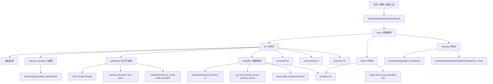

# TECH v2：OSLab TraceBench 资源压力与系统观测实验平台技术方案

## 1. 文档目标

本文档基于 `docs/PRDv2.md` 输出 v2 阶段实现级技术方案，用于指导 `extension/tracebench/` 的代码实现、Makefile 编写、脚本编写、测试设计和报告材料生成。

v2 阶段目标不是替换当前已完成的基础四模块和 `oslab_monitor` 扩展模块，而是在现有项目基础上新增一个用户态 TraceBench 工具，使课程实验能够在 Ubuntu VM 中制造 CPU、内存和 I/O 压力，采集 PSI、cgroup v2 和现有 `/proc/oslab_monitor/overview` 对照数据，并生成稳定 CSV 与 Markdown 报告。

本文档遵循以下原则：

- 与 `docs/PRDv2.md` 保持一致，不新增 P0 未要求的默认依赖。
- P0 详细设计到模块职责、数据结构、权限、错误处理、输出字段和测试口径。
- P1/P2 只作为可降级增强或挑战项说明，不作为 P0 默认验收路径。
- 不修改 `basic/` 四模块，不让基础模块依赖 TraceBench。
- 不修改 Linux 内核源码，不重新编译或替换 Linux 内核。
- 不引入 Python、Node.js、数据库、Prometheus、Grafana 或外部压测工具作为 P0 必需依赖。
- 所有错误输出以 `error:` 开头，正常完成返回 `0`，错误返回非 `0`。

## 2. 范围与需求摘要

### 2.1 P0 功能需求摘要

P0 是 v2 最小可验收版本，必须实现：

- 新增用户态 C 命令行工具 `extension/tracebench/tracebench`。
- 支持 `tracebench --help`。
- 支持 `tracebench run` 子命令。
- 支持 `tracebench report` 子命令。
- 支持 `tracebench cleanup` 子命令。
- `run` 支持 `cpu`、`memory`、`io` 三类 workload。
- `run` 支持按 `duration` 自动结束，并回收自身启动的 workload 进程。
- 默认使用 cgroup v2 创建独立实验 cgroup，将 workload 进程加入 cgroup。
- 采集系统级 PSI：`/proc/pressure/cpu`、`memory`、`io`。
- 采集实验 cgroup 指标：`cpu.stat`、`memory.current`、`memory.events`。
- 如果 `/proc/oslab_monitor/overview` 存在，采集其关键字段作为对照。
- 生成稳定字段顺序的 `samples.csv`。
- 在 `run` 结束时生成 `command.txt`、`environment.txt`、`summary.txt`。
- `report` 读取 `samples.csv` 并生成 Markdown 报告。
- 提供 Bash 集成测试 `extension/tracebench/tests/test_tracebench.sh`。

### 2.2 P1 增强范围

P1 不是 P0 默认验收内容，允许环境不支持时跳过并在报告中说明：

- tracefs 调度事件采样。
- bpftrace 脚本采样。
- 对采样 CSV 做更丰富的汇总统计。
- 增加更多 workload 参数，例如更细粒度的线程数、运行时长、内存增长步长和 I/O 文件大小。

P1 的技术设计必须满足：

- 检测环境能力后再启用。
- 不支持时不影响 P0 `run`、`report`、`cleanup`。
- 启用 tracefs 时必须恢复本次修改的 tracefs 状态。
- 未安装 bpftrace 时 P0 测试不得失败。

### 2.3 P2 挑战范围

P2 仅作为挑战项，不纳入默认验收：

- sched_ext BPF 调度器实验。
- 默认 Linux 调度器与自定义简化调度策略对比。
- 生成调度策略对比报告。

P2 只能在明确支持 sched_ext 的内核环境中运行，不能影响 P0/P1。

### 2.4 非功能需求摘要

#### 可复现性

- 相同参数必须生成相同结构的输出目录。
- 每次实验必须记录完整命令参数到 `command.txt`。
- 每次实验必须记录系统环境到 `environment.txt`，至少包含 `uname -a`、发行版信息、gcc 版本、cgroup v2 检测结果和 PSI 路径检测结果。
- CSV 字段顺序稳定，便于脚本测试和课程报告引用。

#### 安全性

- 不杀死非本次 `tracebench` 启动的进程。
- 不删除用户未指定或不属于项目命名空间的目录。
- `cleanup` 只能清理项目命名空间内的 cgroup 和 TraceBench I/O 临时文件。
- `run` 只写入固定输出文件和 I/O 临时文件，不递归删除输出目录。
- 所有路径操作必须避免通过 `..` 或空路径造成误删。

#### 可靠性

- 实验中断时必须尽量停止 workload 并清理本次创建的 cgroup。
- Bash 测试必须使用 `trap` 尽量执行 cleanup。
- 可选指标失败不能破坏 P0 必需指标采样。
- 必需接口缺失时必须明确报错，不能静默产生不完整的 P0 结果。

#### 简洁性

- P0 只使用 C、Makefile、Bash 和 Linux 系统接口。
- P0 workload 由项目自身实现，不依赖 `stress-ng`、`fio`、`perf` 或 `bpftrace`。
- Markdown 报告只生成文本摘要和表格，不生成图片，不引入图表依赖。

## 3. 运行环境与权限模型

### 3.1 P0 默认验收环境

P0 默认验收环境固定为：

```text
Ubuntu 24.04 LTS VM
Linux 6.11 或同级 Ubuntu 默认内核
gcc
make
bash
cgroup v2
/proc/pressure/cpu
/proc/pressure/memory
/proc/pressure/io
```

Ubuntu 22.04 LTS 只能作为兼容环境，运行前必须检查：

```bash
mount | grep cgroup2
ls /proc/pressure
uname -a
```

如果 cgroup v2 或 `/proc/pressure/*` 不存在，P0 默认验收不成立。

### 3.2 权限矩阵

| 操作 | 默认是否需要 root | 原因 | 权限不足时行为 |
|---|---:|---|---|
| `tracebench --help` | 否 | 只输出帮助 | 正常输出 |
| `tracebench run` 默认模式 | 是 | 需要创建和清理 cgroup v2 实验目录 | 输出 `error:`，返回非 `0` |
| `tracebench run --no-cgroup` | 否 | 跳过 cgroup 创建，仅采集 PSI 和可用的 oslab_monitor | 允许运行，但不满足 P0 完整验收 |
| `tracebench report` | 否 | 只读取 CSV 并写 Markdown | 文件不可读写时输出 `error:` |
| `tracebench cleanup` | 是 | 需要删除 `/sys/fs/cgroup/oslab_tracebench/` | 输出 `error:`，返回非 `0` |
| P1 tracefs | 通常需要 root | tracefs 事件启用和读取受权限限制 | 跳过并记录原因 |
| P1 bpftrace | 通常需要 root | eBPF tracing 受权限和内核配置限制 | 跳过并记录原因 |

### 3.3 不自动提权

`tracebench` 不在程序内部调用 `sudo`，也不自动尝试提权。用户必须显式使用：

```bash
sudo ./tracebench run --profile cpu --duration 5 --sample-interval 1 --output output/cpu
sudo ./tracebench cleanup
```

如果用户未使用 root 权限运行默认 `run`，程序必须输出明确错误，例如：

```text
error: cgroup mode requires root; rerun with sudo or use --no-cgroup for low-permission demo
```

### 3.4 `--no-cgroup` 语义

`--no-cgroup` 仅用于低权限演示，不作为 P0 完整验收路径。

启用 `--no-cgroup` 时：

- 不创建 cgroup。
- 不写入 `/sys/fs/cgroup/*`。
- workload 仍由 `tracebench` 自身启动和回收。
- PSI 仍按系统级采样。
- `/proc/oslab_monitor/overview` 仍按规则采样。
- CSV 中 `cgroup_enabled=false`。
- cgroup 相关字段写 `NA`。
- `summary.txt` 和 Markdown 报告必须说明未启用 cgroup，结果不满足 P0 完整验收。

## 4. 总体架构

### 4.1 架构分层

TraceBench 采用用户态单 CLI、多内部模块的架构。

```text
tracebench CLI
├── 参数解析层
├── run 执行控制层
│   ├── workload 子进程管理
│   ├── cgroup v2 管理
│   ├── PSI / cgroup / oslab_monitor 采样
│   └── CSV / summary 输出
├── report 报告生成层
└── cleanup 清理层
```

设计重点：

- `main.c` 和 `args.c` 只负责命令行分发与参数校验。
- `workload.c` 只负责 CPU、memory、io 三类压力生成。
- `cgroup.c` 只负责 cgroup v2 检测、创建、加入进程、指标读取和清理。
- `sampler.c` 只负责读取和解析 PSI、cgroup、oslab_monitor。
- `report.c` 只负责 summary 与 Markdown 生成。
- `util.c` 放置路径、文件、时间、错误输出等模块内通用函数。

### 4.2 高层架构图



### 4.3 与现有项目的关系

保持不变：

- `basic/scheduler/`
- `basic/memory/`
- `basic/sync/`
- `basic/filesystem/`
- `extension/oslab_monitor/`
- `tests/run_all.sh`
- `docs/PRD.md`
- `docs/TECH.md`

新增内容：

- `extension/tracebench/`
- `docs/TECHv2.md`
- `docs/PLANv2.md`
- `docs/TRACEBENCH_REPORT_TEMPLATE.md`

当前状态：

- `docs/TECHv2.md`、`docs/PLANv2.md` 和 `docs/TRACEBENCH_REPORT_TEMPLATE.md` 已作为 v2 配套文档存在。
- `extension/tracebench/` 是后续实现目标，当前仓库尚未包含可运行的 TraceBench 代码。

可复用内容：

- 如果 `oslab_monitor.ko` 已加载，TraceBench 采集 `/proc/oslab_monitor/overview` 作为对照指标。
- TraceBench 不要求 `oslab_monitor.ko` 必须加载。
- 指定 `--with-oslab-monitor` 时，`/proc/oslab_monitor/overview` 必须存在，否则报错。

## 5. 目录结构与文件职责

v2 新增内容固定放在 `extension/tracebench/`。

```text
extension/
└── tracebench/
    ├── Makefile
    ├── include/
    │   └── tracebench.h
    ├── src/
    │   ├── main.c
    │   ├── args.c
    │   ├── cgroup.c
    │   ├── workload.c
    │   ├── sampler.c
    │   ├── report.c
    │   └── util.c
    ├── scripts/
    │   ├── run_cpu_demo.sh
    │   ├── run_memory_demo.sh
    │   ├── run_io_demo.sh
    │   └── cleanup.sh
    ├── bpftrace/
    │   ├── sched_latency.bt
    │   └── syscall_count.bt
    ├── tests/
    │   └── test_tracebench.sh
    └── output/
        └── .gitkeep
```

### 5.1 文件职责

| 文件 | 职责 |
|---|---|
| `Makefile` | 编译 `tracebench`，清理编译产物 |
| `include/tracebench.h` | 模块内共享常量、结构体和函数声明 |
| `src/main.c` | CLI 入口、子命令分发、顶层错误处理 |
| `src/args.c` | 参数解析、默认值填充、参数合法性校验 |
| `src/cgroup.c` | cgroup v2 检测、路径创建、加入进程、指标读取、清理 |
| `src/workload.c` | CPU、memory、io 三类 workload 子进程逻辑 |
| `src/sampler.c` | PSI、cgroup、oslab_monitor 采样和文本解析 |
| `src/report.c` | `summary.txt` 和 Markdown 报告生成 |
| `src/util.c` | 文件读写、目录创建、时间、字符串校验、错误输出 |
| `scripts/run_cpu_demo.sh` | CPU profile 演示脚本 |
| `scripts/run_memory_demo.sh` | memory profile 演示脚本 |
| `scripts/run_io_demo.sh` | io profile 演示脚本 |
| `scripts/cleanup.sh` | 调用 `tracebench cleanup` 的演示清理脚本 |
| `bpftrace/*.bt` | P1 可选 bpftrace 脚本，P0 不依赖 |
| `tests/test_tracebench.sh` | P0 Bash 集成测试 |
| `output/.gitkeep` | 保留输出目录；生成的 CSV、报告和临时文件默认不提交 |

### 5.2 Makefile 约定

`extension/tracebench/Makefile` 必须支持：

```bash
make
make clean
```

编译建议：

```text
CC = gcc
CFLAGS = -Wall -Wextra -std=c11 -D_POSIX_C_SOURCE=200809L -Iinclude
LDFLAGS = -pthread
```

`make` 生成：

```text
extension/tracebench/tracebench
```

`make clean` 只清理编译产物，例如：

- `tracebench`
- `*.o`

`make clean` 不删除 `output/` 中的实验结果。运行期清理由 `tracebench cleanup` 负责。

## 6. 命令行设计

### 6.1 命令格式

P0 必须支持：

```bash
./tracebench --help
sudo ./tracebench run --profile cpu --duration 5 --sample-interval 1 --output output/cpu
sudo ./tracebench run --profile memory --duration 5 --sample-interval 1 --output output/memory
sudo ./tracebench run --profile io --duration 5 --sample-interval 1 --output output/io
./tracebench report --input output/cpu --output output/cpu_report.md
sudo ./tracebench cleanup
```

低权限演示允许：

```bash
./tracebench run --profile cpu --duration 3 --sample-interval 1 --output output/cpu_demo --no-cgroup
```

### 6.2 参数与默认值

| 参数 | 适用子命令 | 默认值 | 规则 |
|---|---|---:|---|
| `--profile` | `run` | 无 | 必须为 `cpu`、`memory`、`io` |
| `--duration` | `run` | 无 | 正整数秒，必须 `> 0` |
| `--sample-interval` | `run` | 无 | 正整数秒，必须 `> 0` 且 `<= duration` |
| `--output` | `run` | 无 | 输出目录；不存在时创建 |
| `--input` | `report` | 无 | 包含 `samples.csv` 的实验输出目录 |
| `--output` | `report` | 无 | Markdown 输出文件路径 |
| `--cpu-workers` | `run --profile cpu` | `2` | 正整数 |
| `--memory-mb` | `run --profile memory` | `128` | 正整数；默认测试不得超过 `512` |
| `--io-mb` | `run --profile io` | `64` | 正整数 |
| `--cgroup-name` | `run`、`cleanup` | `oslab_tracebench` | 只允许字母、数字、下划线和短横线 |
| `--no-cgroup` | `run` | `false` | 跳过 cgroup，仅用于低权限演示 |
| `--with-oslab-monitor` | `run` | `false` | 要求 `/proc/oslab_monitor/overview` 必须存在 |

### 6.3 参数解析规则

统一规则：

- `--duration` 和 `--sample-interval` 只支持正整数秒，不支持小数。
- `--sample-interval` 不得大于 `--duration`。
- `--profile` 必须显式提供。
- `--output` 必须显式提供。
- `--input` 只用于 `report`，必须显式提供。
- `--cgroup-name` 只允许 `[A-Za-z0-9_-]`。
- 未识别参数、缺失参数值、非法数值必须输出 `error:` 并返回非 `0`。

示例错误：

```text
error: --profile must be one of cpu, memory, io
error: --duration must be a positive integer
error: --sample-interval must be positive and no greater than duration
error: --cgroup-name may only contain letters, digits, '_' and '-'
```

### 6.4 输出目录覆盖语义

如果 `--output output/cpu` 已存在，`run` 允许覆盖以下 TraceBench 固定文件：

- `command.txt`
- `environment.txt`
- `samples.csv`
- `summary.txt`

`run` 不删除输出目录中的其他用户文件。

I/O workload 使用的临时文件固定为：

```text
<output>/tracebench_io.tmp
```

正常结束时删除该临时文件。异常残留时由 `cleanup` 在项目默认输出目录下清理。

### 6.5 退出码

| 场景 | 退出码 |
|---|---:|
| `--help` 正常输出 | `0` |
| `run` 正常完成并生成输出 | `0` |
| `report` 正常生成 Markdown | `0` |
| `cleanup` 正常完成 | `0` |
| 参数错误 | 非 `0` |
| 必需接口缺失 | 非 `0` |
| 权限不足 | 非 `0` |
| workload 启动失败 | 非 `0` |
| 输出文件写入失败 | 非 `0` |

## 7. 核心数据结构

### 7.1 枚举与配置

```c
#define TB_NAME_LEN 64
#define TB_PATH_LEN 512
#define TB_LINE_LEN 1024
#define TB_VALUE_LEN 128

typedef enum {
    TB_CMD_HELP,
    TB_CMD_RUN,
    TB_CMD_REPORT,
    TB_CMD_CLEANUP
} TbCommand;

typedef enum {
    TB_PROFILE_CPU,
    TB_PROFILE_MEMORY,
    TB_PROFILE_IO
} TbProfile;

typedef struct {
    TbCommand command;
    TbProfile profile;
    int duration_sec;
    int sample_interval_sec;
    int cpu_workers;
    int memory_mb;
    int io_mb;
    int no_cgroup;
    int with_oslab_monitor;
    char cgroup_name[TB_NAME_LEN];
    char output_path[TB_PATH_LEN];
    char input_path[TB_PATH_LEN];
    char report_output_path[TB_PATH_LEN];
} TbConfig;
```

设计说明：

- 路径和名称使用固定上限，所有写入前必须检查长度。
- `duration_sec` 和 `sample_interval_sec` 使用整数秒。
- CSV 中的 `elapsed_ms` 使用单调时钟计算，避免系统时间调整影响采样。

### 7.2 cgroup 状态

```c
typedef struct {
    int enabled;
    char root_path[TB_PATH_LEN];
    char profile_path[TB_PATH_LEN];
    char run_path[TB_PATH_LEN];
    char run_id[TB_NAME_LEN];
} TbCgroup;
```

路径规则：

```text
/sys/fs/cgroup/<cgroup_name>/<profile>/<run_id>/
```

默认路径示例：

```text
/sys/fs/cgroup/oslab_tracebench/cpu/20260608_153000_12345/
```

其中：

- `cgroup_name` 默认 `oslab_tracebench`。
- `profile` 为 `cpu`、`memory` 或 `io`。
- `run_id = YYYYMMDD_HHMMSS_<pid>`。

### 7.3 PSI 数据结构

```c
typedef struct {
    int present;
    double avg10;
    double avg60;
    double avg300;
    unsigned long long total;
} TbPsiLine;

typedef struct {
    TbPsiLine some;
    TbPsiLine full;
} TbPsiResource;

typedef struct {
    TbPsiResource cpu;
    TbPsiResource memory;
    TbPsiResource io;
} TbPsiSnapshot;
```

设计规则：

- `some` 行必须存在，否则对应 PSI 文件视为解析失败。
- `full` 行允许不存在，CSV 中写 `NA`。
- `avg10`、`avg60`、`avg300` 输出保留原始解析精度，CSV 建议使用 `%.2f`。
- `total` 使用无符号 64 位整数保存。

### 7.4 cgroup 指标结构

```c
typedef struct {
    int enabled;
    unsigned long long cpu_usage_usec;
    unsigned long long cpu_user_usec;
    unsigned long long cpu_system_usec;
    unsigned long long cpu_nr_periods;
    unsigned long long cpu_nr_throttled;
    unsigned long long cpu_throttled_usec;
    unsigned long long memory_current;
    unsigned long long memory_events_low;
    unsigned long long memory_events_high;
    unsigned long long memory_events_max;
    unsigned long long memory_events_oom;
    unsigned long long memory_events_oom_kill;
    unsigned long long memory_events_oom_group_kill;
    int has_cpu_user_usec;
    int has_cpu_system_usec;
    int has_cpu_nr_periods;
    int has_cpu_nr_throttled;
    int has_cpu_throttled_usec;
    int has_oom_kill;
    int has_oom_group_kill;
} TbCgroupStats;
```

设计规则：

- `usage_usec`、`memory.current`、`memory.events` 为 P0 关键字段。
- 不同内核可能没有全部 throttle 或 OOM group 字段，缺失时 CSV 写 `NA`。
- `--no-cgroup` 时 `enabled=0`，所有 cgroup 指标写 `NA`。

### 7.5 oslab_monitor 对照结构

```c
typedef struct {
    int available;
    int total_tasks_present;
    int running_tasks_present;
    int sleeping_tasks_present;
    int mem_free_kb_present;
    int mem_available_kb_present;
    unsigned long long total_tasks;
    unsigned long long running_tasks;
    unsigned long long sleeping_tasks;
    unsigned long long mem_free_kb;
    unsigned long long mem_available_kb;
} TbOslabSnapshot;
```

设计规则：

- 默认模式下，`/proc/oslab_monitor/overview` 不存在不报错，CSV 写 `oslab_monitor_available=false`。
- 如果文件存在但某些字段缺失，继续运行，缺失字段写 `NA`。
- 指定 `--with-oslab-monitor` 且文件不存在或打不开时，`run` 必须输出 `error:` 并返回非 `0`。

### 7.6 单行采样结构

```c
typedef struct {
    int sample_index;
    long long elapsed_ms;
    TbProfile profile;
    TbPsiSnapshot psi;
    TbCgroupStats cgroup;
    TbOslabSnapshot oslab;
} TbSample;
```

`TbSample` 只保存一行采样所需状态。实现可逐行写 CSV，不必把全部采样行保存在内存中。

## 8. `run` 执行流程

### 8.1 总体流程

`tracebench run` 按以下顺序执行：

1. 解析参数并填充默认值。
2. 校验权限、profile、duration、sample interval、输出路径和 cgroup 名称。
3. 创建输出目录。
4. 写入 `command.txt`。
5. 写入 `environment.txt`。
6. 检测 `/proc/pressure/cpu`、`memory`、`io` 是否存在。
7. 如果启用 cgroup，检测 cgroup v2 并创建实验 cgroup。
8. 如果指定 `--with-oslab-monitor`，检测 `/proc/oslab_monitor/overview` 是否可读。
9. 创建父子进程启动同步 pipe。
10. `fork()` 创建 workload 子进程。
11. 子进程等待父进程发送启动信号。
12. 父进程把 workload 子进程 PID 写入 cgroup `cgroup.procs`。
13. 父进程通过 pipe 通知子进程开始 workload。
14. 父进程按采样间隔读取 PSI、cgroup、oslab_monitor，并写入 `samples.csv`。
15. 到达 `duration` 后通知 workload 结束。
16. 等待 workload 子进程退出。
17. 删除本次 I/O 临时文件。
18. 移除本次空 cgroup。
19. 生成 `summary.txt`。
20. 返回 `0`。

### 8.2 父子进程与 cgroup 加入顺序

必须使用 pipe 控制 workload 子进程启动，避免子进程在加入 cgroup 前就开始制造压力。

推荐流程：

```text
parent creates pipe
parent forks child
child blocks on pipe read
parent creates cgroup
parent writes child pid to cgroup.procs
parent writes "start" byte to pipe
child starts workload
parent samples until duration expires
parent sends termination signal or shared stop condition
parent waitpid(child)
```

设计理由：

- 确保 workload 主要压力发生在目标 cgroup 内。
- 避免前几行采样缺失 cgroup 统计变化。
- 父进程保留清理控制权。

### 8.3 信号与中断处理

`run` 必须处理 `SIGINT` 和 `SIGTERM`。

中断时：

1. 设置全局停止标志。
2. 如果 workload 子进程仍存在，只终止本次启动的子进程。
3. `waitpid()` 回收子进程。
4. 尽量删除本次创建的 cgroup。
5. 尽量删除本次 I/O 临时文件。
6. 返回非 `0`。

不得扫描并杀死系统中名字相似的其他进程。

### 8.4 采样时间语义

`--duration 5 --sample-interval 1` 至少生成 5 行采样。

采样点约为：

```text
0s, 1s, 2s, 3s, 4s
```

不强制生成第 6 行 `5s` 采样，避免不同 VM 调度延迟导致测试不稳定。

CSV 中：

- `sample_index` 从 `0` 开始。
- `elapsed_ms` 使用 `clock_gettime(CLOCK_MONOTONIC, ...)` 计算。
- `duration_sec` 和 `sample_interval_sec` 写入每一行，便于单独分析 CSV。

## 9. Workload 技术设计

### 9.1 通用规则

所有 workload 必须：

- 由 TraceBench 自身实现。
- 在子进程中运行。
- 按 `duration` 自动结束。
- 支持父进程中断时被回收。
- 不依赖外部压测工具。
- 不采集用户隐私内容。

### 9.2 CPU profile

CPU profile 子进程创建 `--cpu-workers` 个 pthread worker。

默认：

```text
--cpu-workers 2
```

worker 行为：

- 每个 worker 执行 CPU 密集型循环。
- 循环内使用 `volatile` 或等价方式避免被编译器完全优化。
- worker 周期性检查停止标志或截止时间。
- 到达 `duration` 后退出。

伪流程：

```text
for i in cpu_workers:
    pthread_create(cpu_spin_worker)
sleep or poll until deadline
set stop flag
join all workers
exit
```

验收关注：

- `samples.csv` 中 CPU PSI 或 cgroup CPU 使用量字段存在。
- `cgroup_cpu_usage_usec` 在实验期间通常应增加。

### 9.3 memory profile

memory profile 子进程分配并持续触碰指定大小内存。

默认：

```text
--memory-mb 128
```

测试默认上限：

```text
512 MB
```

行为：

- 使用 `malloc()` 或 `calloc()` 分配 `memory_mb`。
- 按页大小步进写入内存，确保物理页实际映射。
- 在实验期间周期性重新触碰页面。
- 不主动设置导致 OOM 的 cgroup 限制。
- 到达 `duration` 后释放内存并退出。

设计理由：

- 能让 `memory.current` 和 memory PSI 有可观察变化。
- 避免课程 VM 因不可控 OOM 导致测试不稳定。

### 9.4 I/O profile

I/O profile 子进程在输出目录中写入临时文件：

```text
<output>/tracebench_io.tmp
```

默认：

```text
--io-mb 64
```

行为：

- 使用固定大小缓冲区，例如 `1 MiB`。
- 重复写入直到临时文件达到 `io_mb`。
- 每轮写完后执行 `fsync()`。
- 如果距离 `duration` 结束仍有时间，可重新覆盖同一临时文件以持续制造 I/O。
- 到达 `duration` 后关闭文件。
- 正常结束时删除临时文件。

设计理由：

- 文件路径位于输出目录，便于限制和清理。
- `fsync()` 让 I/O 压力更容易体现在 PSI 中。
- 使用覆盖同一文件避免无限增长占满磁盘。

## 10. cgroup v2 技术设计

### 10.1 检测

默认模式下，`run` 必须检测：

- `/sys/fs/cgroup` 是否存在。
- 当前挂载是否为 cgroup v2。
- 是否能创建 `/sys/fs/cgroup/<cgroup_name>/`。
- 创建的 run cgroup 下是否存在 `cgroup.procs`。
- 是否能读取 `cpu.stat`。
- 是否能读取 `memory.current`。
- 是否能读取 `memory.events`。

任一 P0 必需 cgroup 条件不满足时，默认模式必须输出 `error:` 并返回非 `0`。

`--no-cgroup` 模式跳过上述写入性检测，但仍可记录检测结果到 `environment.txt`。

### 10.2 路径创建

默认 cgroup 根路径：

```text
/sys/fs/cgroup/oslab_tracebench/
```

每次实验路径：

```text
/sys/fs/cgroup/oslab_tracebench/<profile>/<run_id>/
```

示例：

```text
/sys/fs/cgroup/oslab_tracebench/memory/20260608_153000_12345/
```

创建顺序：

1. 创建 root cgroup。
2. 创建 profile cgroup。
3. 创建 run cgroup。
4. 将 workload 子进程 PID 写入 run cgroup 的 `cgroup.procs`。

### 10.3 P0 不设置资源限制

P0 不强制写入：

- `cpu.max`
- `memory.max`
- `memory.high`
- `io.max`

设计理由：

- PRDv2 P0 的验收重点是 workload、采样、CSV 和报告。
- 默认不限制资源可避免课程 VM 触发不可控 OOM 或系统卡顿。
- 后续 P1 可增加显式资源限制参数，但不能改变 P0 默认行为。

### 10.4 指标读取

必须读取：

```text
cpu.stat
memory.current
memory.events
```

`cpu.stat` 常见字段：

```text
usage_usec
user_usec
system_usec
nr_periods
nr_throttled
throttled_usec
```

`memory.events` 常见字段：

```text
low
high
max
oom
oom_kill
oom_group_kill
```

字段缺失处理：

- `usage_usec`、`memory.current`、`memory.events` 中 PRDv2 最低字段缺失时，默认模式报错。
- 增强字段缺失时 CSV 写 `NA`。

### 10.5 实验结束清理

单次 `run` 正常结束时只删除本次创建且已经为空的 run cgroup：

```text
/sys/fs/cgroup/oslab_tracebench/<profile>/<run_id>/
```

如果 profile cgroup 或 root cgroup 已为空，可以顺带删除；如果不为空，则保留，避免影响其他并发或残留实验。

删除失败时：

- 如果 workload 已回收但 cgroup 暂时忙，输出警告到 `summary.txt` 或 stderr。
- 主流程已完成采样时可以返回 `0`，但必须提示用户运行 `sudo ./tracebench cleanup`。

### 10.6 cleanup 清理范围

`tracebench cleanup` 只清理：

```text
/sys/fs/cgroup/oslab_tracebench/
extension/tracebench/output/*/tracebench_io.tmp
```

约束：

- 不删除 `samples.csv`。
- 不删除 Markdown 报告。
- 不删除用户指定输出目录。
- 不删除 `output/` 整体目录。
- 不根据任意 `--output` 参数递归删除目录。
- 不杀死无法证明属于本次运行的进程。

如果 cgroup 中仍有进程，cleanup 必须输出 `error:` 或明确提示，不能强行杀死无法证明归属的进程。

## 11. 采样器技术设计

### 11.1 PSI 采样

必须读取：

```text
/proc/pressure/cpu
/proc/pressure/memory
/proc/pressure/io
```

每个文件解析：

```text
some avg10=0.00 avg60=0.00 avg300=0.00 total=123456
full avg10=0.00 avg60=0.00 avg300=0.00 total=123456
```

规则：

- `some` 行必须解析 `avg10`、`avg60`、`avg300`、`total`。
- `full` 行也尽量解析同样字段。
- 某资源没有 `full` 行时，CSV 对应字段写 `NA`。
- 如果 `/proc/pressure/*` 不存在，默认 `run` 返回非 `0`，提示内核不支持 PSI。

### 11.2 oslab_monitor 采样

默认读取路径：

```text
/proc/oslab_monitor/overview
```

采集字段：

```text
total_tasks
running_tasks
sleeping_tasks
mem_free_kb
mem_available_kb
```

规则：

- 文件不存在：默认不报错，CSV 写 `oslab_monitor_available=false`，字段写 `NA`。
- 文件存在但字段缺失：CSV 写 `oslab_monitor_available=true`，缺失字段写 `NA`。
- 指定 `--with-oslab-monitor` 且文件不存在或无法读取：输出 `error:` 并返回非 `0`。

### 11.3 采样失败处理

| 指标 | P0 是否必需 | 失败行为 |
|---|---:|---|
| `/proc/pressure/cpu` | 是 | `error:`，返回非 `0` |
| `/proc/pressure/memory` | 是 | `error:`，返回非 `0` |
| `/proc/pressure/io` | 是 | `error:`，返回非 `0` |
| cgroup `cpu.stat` 默认模式 | 是 | `error:`，返回非 `0` |
| cgroup `memory.current` 默认模式 | 是 | `error:`，返回非 `0` |
| cgroup `memory.events` 默认模式 | 是 | `error:`，返回非 `0` |
| `/proc/oslab_monitor/overview` 默认模式 | 否 | CSV 写 unavailable |
| `/proc/oslab_monitor/overview` with flag | 是 | `error:`，返回非 `0` |
| P1 tracefs | 否 | 跳过并记录原因 |
| P1 bpftrace | 否 | 跳过并记录原因 |

## 12. CSV 输出规范

### 12.1 文件路径

每次 `run` 必须生成：

```text
<output>/samples.csv
```

### 12.2 CSV 格式

规则：

- 第一行为稳定表头。
- 每行字段数量必须与表头一致。
- 布尔值使用 `true` 或 `false`。
- 缺失或不适用字段使用 `NA`。
- 数值字段不添加单位。
- 浮点 PSI `avg*` 字段建议保留两位小数。
- 路径字段不得包含逗号；如果未来需要支持逗号路径，必须实现 CSV 转义。

### 12.3 稳定字段表

P0 CSV 表头固定为：

```text
sample_index
elapsed_ms
profile
duration_sec
sample_interval_sec
run_id
cgroup_enabled
cgroup_path
cpu_some_avg10
cpu_some_avg60
cpu_some_avg300
cpu_some_total
cpu_full_avg10
cpu_full_avg60
cpu_full_avg300
cpu_full_total
memory_some_avg10
memory_some_avg60
memory_some_avg300
memory_some_total
memory_full_avg10
memory_full_avg60
memory_full_avg300
memory_full_total
io_some_avg10
io_some_avg60
io_some_avg300
io_some_total
io_full_avg10
io_full_avg60
io_full_avg300
io_full_total
cgroup_cpu_usage_usec
cgroup_cpu_user_usec
cgroup_cpu_system_usec
cgroup_cpu_nr_periods
cgroup_cpu_nr_throttled
cgroup_cpu_throttled_usec
cgroup_memory_current
cgroup_memory_events_low
cgroup_memory_events_high
cgroup_memory_events_max
cgroup_memory_events_oom
cgroup_memory_events_oom_kill
cgroup_memory_events_oom_group_kill
oslab_monitor_available
oslab_total_tasks
oslab_running_tasks
oslab_sleeping_tasks
oslab_mem_free_kb
oslab_mem_available_kb
```

字段说明：

| 字段 | 来源 | 说明 |
|---|---|---|
| `sample_index` | TraceBench | 从 `0` 开始 |
| `elapsed_ms` | TraceBench | 单调时钟相对毫秒 |
| `profile` | 参数 | `cpu`、`memory`、`io` |
| `duration_sec` | 参数 | 实验目标时长 |
| `sample_interval_sec` | 参数 | 采样间隔 |
| `run_id` | TraceBench | `YYYYMMDD_HHMMSS_<pid>` |
| `cgroup_enabled` | 参数/运行状态 | `true` 或 `false` |
| `cgroup_path` | cgroup | 启用 cgroup 时为 run cgroup 路径，否则 `NA` |
| `cpu_*` | PSI | CPU pressure 字段 |
| `memory_*` | PSI | memory pressure 字段 |
| `io_*` | PSI | I/O pressure 字段 |
| `cgroup_cpu_*` | cgroup `cpu.stat` | CPU 使用和限流统计 |
| `cgroup_memory_current` | cgroup `memory.current` | 当前内存占用字节 |
| `cgroup_memory_events_*` | cgroup `memory.events` | 内存事件计数 |
| `oslab_monitor_available` | `/proc/oslab_monitor/overview` | 是否成功读取 oslab_monitor |
| `oslab_*` | `/proc/oslab_monitor/overview` | 对照采样字段 |

### 12.4 最小行数

采样行数按以下公式确定最低预期：

```text
min_rows = ceil(duration_sec / sample_interval_sec)
```

例如：

```text
duration=5, sample_interval=1 -> 至少 5 行
duration=5, sample_interval=2 -> 至少 3 行
duration=3, sample_interval=1 -> 至少 3 行
```

## 13. 输出文件规范

一次 CPU 实验输出目录示例：

```text
extension/tracebench/output/cpu/
├── command.txt
├── environment.txt
├── samples.csv
└── summary.txt
```

运行 `report` 后可生成：

```text
extension/tracebench/output/cpu/report.md
```

或用户指定的其他 Markdown 文件：

```text
extension/tracebench/output/cpu_report.md
```

### 13.1 `command.txt`

记录完整运行命令。

内容建议：

```text
command: sudo ./tracebench run --profile cpu --duration 5 --sample-interval 1 --output output/cpu
profile: cpu
duration_sec: 5
sample_interval_sec: 1
cgroup_name: oslab_tracebench
no_cgroup: false
with_oslab_monitor: false
```

### 13.2 `environment.txt`

记录系统环境。

必须包含：

```text
uname:
os_release:
gcc:
cgroup_v2:
psi_cpu:
psi_memory:
psi_io:
oslab_monitor_overview:
tracebench_version:
```

`tracebench_version` 可以先使用固定文本，例如：

```text
tracebench_version: v2-p0
```

### 13.3 `summary.txt`

`summary.txt` 在 `run` 结束时生成。

必须包含：

- profile。
- duration。
- sample interval。
- samples.csv 路径。
- 采样行数。
- cgroup 是否启用。
- oslab_monitor 是否可用。
- 关键指标 first、last、delta、max 摘要。
- 如果使用 `--no-cgroup`，必须说明不满足 P0 完整验收。
- 如果清理 cgroup 或 I/O 临时文件失败，必须说明。

### 13.4 Markdown 报告

`tracebench report` 读取：

```text
<input>/samples.csv
```

写入：

```text
--output <markdown_path>
```

推荐报告路径：

```text
<input>/report.md
```

报告必须引用 `samples.csv` 路径。

## 14. 报告生成设计

### 14.1 命令格式

```bash
./tracebench report --input output/cpu --output output/cpu/report.md
```

或：

```bash
./tracebench report --input output/cpu --output output/cpu_report.md
```

### 14.2 摘要计算口径

不引入复杂统计库。对数值字段只计算：

```text
first
last
delta = last - first
max
```

重点字段：

- `cpu_some_total`
- `memory_some_total`
- `io_some_total`
- `cgroup_cpu_usage_usec`
- `cgroup_memory_current`
- `cgroup_memory_events_high`
- `cgroup_memory_events_max`
- `cgroup_memory_events_oom`
- `oslab_total_tasks`
- `oslab_running_tasks`
- `oslab_mem_free_kb`
- `oslab_mem_available_kb`

对于 `NA` 字段：

- 统计时跳过。
- 若整列均为 `NA`，报告写“未采集”。

### 14.3 Markdown 报告结构

固定结构：

```markdown
# OSLab TraceBench 实验报告

## 1. 实验配置
## 2. 运行环境
## 3. 采样文件
## 4. PSI 资源压力摘要
## 5. cgroup 指标摘要
## 6. oslab_monitor 对照结果
## 7. 实验现象分析
## 8. 局限性
```

报告内容要求：

- 包含 `PSI`、`cgroup`、`oslab_monitor` 三类关键词。
- 包含 profile、duration、sample interval。
- 包含 `samples.csv` 的路径。
- 如果 `--no-cgroup`，在局限性中说明。
- 如果 oslab_monitor 不可用，在对照结果中说明。
- 分析段落必须是课程报告可引用的自然语言，不只输出表格。

## 15. cleanup 技术设计

### 15.1 命令格式

```bash
sudo ./tracebench cleanup
```

可选指定 cgroup 名：

```bash
sudo ./tracebench cleanup --cgroup-name oslab_tracebench
```

### 15.2 清理对象

只清理：

```text
/sys/fs/cgroup/<cgroup_name>/
extension/tracebench/output/*/tracebench_io.tmp
```

其中默认：

```text
cgroup_name = oslab_tracebench
```

### 15.3 清理算法

cgroup 清理：

1. 检查 `/sys/fs/cgroup/<cgroup_name>/` 是否存在。
2. 自底向上扫描 profile 和 run cgroup。
3. 对空 cgroup 执行 `rmdir()`。
4. 如果某 cgroup 仍有进程，停止删除该 cgroup，并输出明确提示。
5. 不杀死无法证明属于 TraceBench 当前运行的进程。

I/O 临时文件清理：

1. 只扫描 `extension/tracebench/output/` 下一层 profile 目录。
2. 只删除文件名精确为 `tracebench_io.tmp` 的文件。
3. 不递归删除其他文件或目录。

## 16. 错误处理设计

### 16.1 统一错误格式

所有错误输出必须以 `error:` 开头。

示例：

```text
error: /proc/pressure/cpu not found; kernel PSI is required for P0
error: failed to create cgroup /sys/fs/cgroup/oslab_tracebench/cpu/20260608_153000_12345: Permission denied
error: samples.csv not found under output/cpu
```

### 16.2 常见错误场景

| 场景 | 行为 |
|---|---|
| 非法 profile | 输出 `error:`，返回非 `0` |
| duration 非正整数 | 输出 `error:`，返回非 `0` |
| sample interval 大于 duration | 输出 `error:`，返回非 `0` |
| 默认 run 未使用 root | 输出 `error:`，返回非 `0` |
| cgroup v2 不存在 | 输出 `error:`，返回非 `0` |
| PSI 文件缺失 | 输出 `error:`，返回非 `0` |
| workload fork 失败 | 输出 `error:`，返回非 `0` |
| workload 异常退出 | 输出 `error:`，尽量清理，返回非 `0` |
| 输出目录无法创建 | 输出 `error:`，返回非 `0` |
| CSV 写入失败 | 输出 `error:`，尽量清理，返回非 `0` |
| report input 缺少 samples.csv | 输出 `error:`，返回非 `0` |
| cleanup 权限不足 | 输出 `error:`，返回非 `0` |

### 16.3 警告与非致命情况

以下情况不一定导致失败，但必须记录：

- 默认模式下 oslab_monitor 未加载。
- oslab_monitor 文件存在但部分字段缺失。
- PSI 某资源没有 `full` 行。
- cgroup 增强字段不存在。
- run 结束时 profile/root cgroup 非空，无法顺带删除。
- I/O 临时文件已经不存在。

警告可以写入 stderr 或 `summary.txt`，但不能使用 `error:` 前缀，避免测试误判。

## 17. 测试设计

### 17.1 测试目录

P0 测试脚本固定为：

```text
extension/tracebench/tests/test_tracebench.sh
```

脚本必须使用 Bash，并在开头设置：

```bash
set -euo pipefail
```

必须使用 `trap`：

```bash
# 使用 trap 是为了测试中途失败时仍尽量清理 cgroup 和临时文件，避免影响后续验收。
trap cleanup EXIT
```

### 17.2 单元级检查

不引入额外 C 测试框架。单元级检查通过脚本驱动小输入和固定输出完成。

至少覆盖：

- 参数解析错误。
- 非法 profile。
- 非法 duration。
- `--sample-interval > --duration`。
- CSV 表头字段完整性。
- CSV 每行字段数量一致。
- `tracebench report` 对 `samples.csv` 的读取和 Markdown 生成。
- `--with-oslab-monitor` 在模块未加载时返回非 `0`。

### 17.3 集成测试内容

`test_tracebench.sh` 必须检查：

1. `make` 成功生成 `tracebench`。
2. `./tracebench --help` 输出包含 `run`、`report`、`cleanup`。
3. 非法 profile 返回非 `0`，输出包含 `error:`。
4. CPU profile 运行成功。
5. memory profile 运行成功。
6. io profile 运行成功。
7. 每个 profile 生成 `samples.csv`。
8. 每个 `samples.csv` 表头包含 PSI、cgroup 和 oslab_monitor 字段。
9. 每个 `samples.csv` 行数字段数量一致。
10. `tracebench report` 成功生成 Markdown。
11. Markdown 包含 `PSI`、`cgroup`、`oslab_monitor` 和 `samples.csv` 路径。
12. `tracebench cleanup` 不报错。

### 17.4 oslab_monitor 测试口径

P0 TraceBench 测试不强制自动构建或加载 `oslab_monitor.ko`。

默认测试：

- 未加载模块时，运行实验不失败。
- CSV 包含 `oslab_monitor_available=false`。

条件增强测试：

- 如果测试开始时 `/proc/oslab_monitor/overview` 已存在，则额外检查 CSV 包含 `oslab_total_tasks` 非 `NA` 或至少字段存在。

错误测试：

- 未加载模块时运行：

```bash
sudo ./tracebench run --profile cpu --duration 1 --sample-interval 1 --output output/with_om --with-oslab-monitor
```

必须返回非 `0`，输出包含 `error:`。

### 17.5 推荐测试命令

```bash
cd extension/tracebench
make
./tracebench --help
sudo ./tracebench run --profile cpu --duration 3 --sample-interval 1 --output output/cpu
./tracebench report --input output/cpu --output output/cpu/report.md
sudo ./tracebench cleanup
bash tests/test_tracebench.sh
make clean
```

## 18. P1/P2 技术预留

### 18.1 tracefs 调度事件采样

P1 tracefs 优先检测以下路径：

```text
/sys/kernel/tracing
/sys/kernel/debug/tracing
```

可选事件：

```text
events/sched/sched_switch
events/sched/sched_wakeup
```

设计要求：

- 检测 tracefs 是否挂载。
- 检测事件路径是否存在。
- 记录启用前状态。
- 实验期间启用本次需要的事件。
- 实验结束后恢复本次修改的状态。
- tracefs 不可用时 P0 主实验仍可完成。
- TECHv2 不把 tracefs 输出文件格式作为 P0 稳定接口。

### 18.2 bpftrace 脚本

保留目录：

```text
extension/tracebench/bpftrace/
```

脚本职责：

- `sched_latency.bt`：用于调度延迟或 off-CPU 相关观察。
- `syscall_count.bt`：用于系统调用计数观察。

设计要求：

- P0 Makefile 不依赖 bpftrace。
- P0 测试不要求 bpftrace。
- 如果 `command -v bpftrace` 不存在，跳过并在报告中说明。
- bpftrace 执行失败不能影响 P0 CSV 和 Markdown 报告生成。

### 18.3 sched_ext 挑战项

sched_ext 仅作为 P2 挑战项。

约束：

- 不在 `extension/tracebench/` P0 默认路径中实现。
- 可后续新增 `extension/sched_ext_lab/`。
- 必须显式检测内核是否支持 sched_ext。
- 不支持 sched_ext 的环境不能影响 P0/P1。
- 报告必须说明内核版本和 sched_ext ABI 风险。

## 19. 失败模式与缓解措施

| 失败模式 | 影响 | 缓解措施 |
|---|---|---|
| 未使用 root 运行默认 `run` | 无法创建 cgroup | 输出 `error:`，提示使用 sudo 或 `--no-cgroup` |
| 系统未启用 cgroup v2 | 无法满足 P0 cgroup 验收 | 输出 `error:`，记录环境检查命令 |
| `/proc/pressure/*` 不存在 | 无法采集 PSI | 输出 `error:`，说明内核不支持 PSI |
| workload 在加入 cgroup 前开始运行 | cgroup 指标不完整 | 使用 pipe 让子进程等待父进程加入 cgroup 后再启动 |
| memory workload 触发 OOM | VM 不稳定，测试失败 | P0 不设置 `memory.max`，默认 128 MB，测试上限 512 MB |
| I/O workload 写爆磁盘 | VM 不稳定 | 覆盖固定临时文件，默认 64 MB，正常结束删除 |
| 采样行数受调度延迟影响 | 测试不稳定 | 只要求最小行数，不强制末尾第 6 行 |
| CSV 字段顺序变化 | 测试和报告失效 | 固定表头，新增字段需同步 PRDv2/TECHv2/PLANv2 |
| oslab_monitor 未加载 | 对照字段不可用 | 默认不报错，CSV 写 unavailable；指定 flag 时才失败 |
| cleanup 误删用户文件 | 数据丢失 | cleanup 只删除 cgroup 命名空间和精确命名临时文件 |
| 中断导致 cgroup 残留 | 后续测试受影响 | signal handler 尽量回收；测试脚本使用 trap cleanup |
| tracefs/bpftrace 不可用 | P1 采样缺失 | P1 可降级，不影响 P0 |

## 20. 关键架构决策

### ADR-001：v2 新增 `extension/tracebench/`，不改动基础四模块

#### 状态

Accepted

#### 背景

v1 已完成基础四个 C CLI 模块和 `oslab_monitor` 内核扩展。v2 目标是新增真实 Linux 资源压力与观测实验平台，而不是重写已有基础实验。

#### 决策

新增 `extension/tracebench/` 存放 TraceBench 用户态工具、脚本、测试和输出目录。保持 `basic/` 和 `extension/oslab_monitor/` 不变。

#### 正面影响

- v1 已完成能力不受影响。
- v2 边界清晰，便于单独验收。
- TraceBench 可以复用 oslab_monitor 输出作为对照，但不强依赖。

#### 负面影响

- README、FEATURES、PLANv2 后续需要同步说明新增模块。

#### 替代方案

- 修改 `extension/oslab_monitor/`：会混合内核模块和资源压力实验职责。
- 把 TraceBench 放到根目录：会弱化扩展模块边界。

### ADR-002：P0 使用 C、Makefile、Bash，不依赖外部压测工具

#### 状态

Accepted

#### 背景

PRDv2 要求 workload 由项目自身实现，不能强依赖 `stress-ng`、`fio` 等外部工具。课程验收环境应尽量减少额外安装。

#### 决策

P0 使用 C 实现 CLI、workload、采样和报告生成；使用 Makefile 构建；使用 Bash 做集成测试。

#### 正面影响

- 环境依赖少。
- 更符合操作系统课程设计定位。
- workload 行为可解释、可控。

#### 负面影响

- 自研 workload 精度不如专业压测工具。
- Markdown 摘要能力保持简单，不生成图表。

#### 替代方案

- 使用 `stress-ng`、`fio`：实现快，但不满足 PRDv2 P0 边界。
- 使用 Python 生成报告：开发便利，但增加 P0 依赖。

### ADR-003：默认 `run` 和 `cleanup` 需要 root，不静默降级

#### 状态

Accepted

#### 背景

cgroup v2 创建和清理通常需要 root。若程序在权限不足时自动跳过 cgroup，会导致用户误以为完成了 P0 验收。

#### 决策

默认 `run` 和 `cleanup` 需要 root。权限不足时输出 `error:`。只有用户显式指定 `--no-cgroup` 时才进入低权限演示模式。

#### 正面影响

- 验收口径明确。
- 避免静默生成不完整数据。
- 错误提示直接。

#### 负面影响

- 用户必须使用 `sudo` 才能完成 P0。

#### 替代方案

- 自动降级为 `--no-cgroup`：容易产生不满足验收的结果。
- 程序内部调用 `sudo`：交互复杂，不适合 C CLI 和测试脚本。

### ADR-004：P0 使用 cgroup v2 归组和采样，但不设置资源限制

#### 状态

Accepted

#### 背景

PRDv2 要求使用 cgroup v2 创建实验目录并采集 CPU、内存指标，但没有强制要求 P0 设置 `cpu.max` 或 `memory.max`。课程 VM 资源差异较大，强制限制可能导致 OOM 或卡顿。

#### 决策

P0 创建 cgroup、加入 workload、采集 `cpu.stat`、`memory.current`、`memory.events`。默认不写 `cpu.max`、`memory.max`、`memory.high`。

#### 正面影响

- 降低误触发 OOM 风险。
- P0 稳定性更高。
- 仍能观察真实 cgroup 统计变化。

#### 负面影响

- “资源限制”体验不如设置 quota 直观。

#### 替代方案

- 默认设置 CPU 和内存限制：观测变化可能更明显，但环境风险更高。
- 完全不使用 cgroup：不满足 PRDv2 P0。

### ADR-005：workload 使用父进程采样、子进程施压的模型

#### 状态

Accepted

#### 背景

TraceBench 需要同时制造压力和周期采样。如果同一进程内混合采样和施压，线程退出、cgroup 加入和清理边界会更复杂。

#### 决策

`tracebench run` 由父进程负责采样、cgroup 管理和清理；fork 出 workload 子进程负责施压。子进程通过 pipe 等待父进程加入 cgroup 后再开始运行。

#### 正面影响

- workload 归属清晰。
- 父进程可以可靠回收子进程。
- cgroup 指标更准确。

#### 负面影响

- 实现比单进程线程模型稍复杂。

#### 替代方案

- 单进程多线程：实现简单，但 cgroup 和清理边界不如父子进程清晰。
- 外部进程工具：不符合 P0 自研 workload 要求。

### ADR-006：CSV 输出完整 PSI 字段并保持表头稳定

#### 状态

Accepted

#### 背景

PRDv2 既要求解析 `some/full` 的 `avg10/avg60/avg300/total`，又给出最低 CSV 字段。为了避免后续报告和测试对字段理解不一致，需要固定完整字段。

#### 决策

CSV 输出 CPU、memory、I/O 三类 PSI 的 `some` 和 `full` 全部字段。没有 `full` 行时写 `NA`。字段顺序在 TECHv2 中固定。

#### 正面影响

- 数据完整。
- 测试脚本容易检查。
- 报告可选择不同字段分析。

#### 负面影响

- CSV 列数较多。

#### 替代方案

- 只输出 PRDv2 最低字段：更短，但浪费已解析信息。
- 输出动态字段：灵活，但不利于测试和报告。

### ADR-007：Markdown 报告只生成文本摘要和表格

#### 状态

Accepted

#### 背景

课程报告需要可引用材料，但 P0 不应引入图表库或额外语言依赖。

#### 决策

`tracebench report` 只生成 Markdown 文本、表格和简单分析段落。摘要统计只计算 first、last、delta、max。

#### 正面影响

- 实现简单。
- 无额外依赖。
- 报告内容可直接复制进课程报告。

#### 负面影响

- 不提供自动图表。

#### 替代方案

- 生成图片或 HTML：视觉效果更好，但超出 P0 简洁性要求。

### ADR-008：tracefs、bpftrace 和 sched_ext 全部可降级

#### 状态

Accepted

#### 背景

tracefs、bpftrace 和 sched_ext 与现代 Linux 观测高度相关，但权限、内核配置和包安装差异较大。

#### 决策

tracefs 和 bpftrace 作为 P1 可选增强；sched_ext 作为 P2 挑战项。不支持时 P0 仍可完成。

#### 正面影响

- P0 验收稳定。
- 保留进阶扩展空间。
- 环境限制可以在报告中明确说明。

#### 负面影响

- P0 不包含调度事件级 tracing。

#### 替代方案

- 把 tracefs 纳入 P0：更贴近 tracing，但权限和内核差异会增加验收风险。
- 把 bpftrace 纳入 P0：现代性更强，但依赖过重。

## 21. PRDv2 一致性检查表

| PRDv2 要求 | TECHv2 对应章节 | 状态 |
|---|---|---|
| 新增 `tracebench` | 第 5、6 章 | 已覆盖 |
| 支持 `run`、`report`、`cleanup` | 第 6、8、14、15 章 | 已覆盖 |
| CPU、memory、io 三类 workload | 第 9 章 | 已覆盖 |
| 创建、使用和清理 cgroup v2 | 第 10、15 章 | 已覆盖 |
| 采集系统级 PSI | 第 11、12 章 | 已覆盖 |
| 采集 cgroup CPU 和内存指标 | 第 10、12 章 | 已覆盖 |
| 采集 oslab_monitor overview 对照 | 第 11、12 章 | 已覆盖 |
| 生成 `samples.csv` | 第 12、13 章 | 已覆盖 |
| 生成 Markdown 报告 | 第 14 章 | 已覆盖 |
| Bash 集成测试 | 第 17 章 | 已覆盖 |
| `--no-cgroup` 低权限演示 | 第 3、6、12、13 章 | 已覆盖 |
| `--with-oslab-monitor` | 第 6、11、17 章 | 已覆盖 |
| 输出目录规范 | 第 13 章 | 已覆盖 |
| cleanup 安全边界 | 第 10、15 章 | 已覆盖 |
| P1 tracefs | 第 18 章 | 已覆盖为可选 |
| P1 bpftrace | 第 18 章 | 已覆盖为可选 |
| P2 sched_ext | 第 18 章 | 已覆盖为挑战项 |
| 不修改基础四模块 | 第 4、20 章 | 已覆盖 |
| 不强依赖外部压测工具 | 第 2、9、20 章 | 已覆盖 |
| 不引入 GUI/Web/监控平台 | 第 1、2 章 | 已覆盖 |

## 22. 实施顺序建议

`docs/PLANv2.md` 已按以下顺序展开后续实现任务：

1. 创建 `extension/tracebench/` 目录、Makefile、头文件和空输出目录。
2. 实现 `tracebench --help`、参数解析和错误处理。
3. 实现输出目录创建、`command.txt`、`environment.txt`。
4. 实现 PSI 检测和解析。
5. 实现 cgroup v2 检测、创建、加入进程和清理。
6. 实现 CPU workload 和父子进程启动同步。
7. 实现 memory workload。
8. 实现 I/O workload 和临时文件清理。
9. 实现周期采样和 `samples.csv` 输出。
10. 实现 oslab_monitor overview 对照采样。
11. 实现 `summary.txt`。
12. 实现 `tracebench report` Markdown 生成。
13. 实现 `tracebench cleanup`。
14. 编写 demo scripts。
15. 编写 `tests/test_tracebench.sh`。
16. 在 Ubuntu 24.04 VM 中运行 P0 集成测试。
17. 同步 README、FEATURES、DOC_AUDIT 和报告模板。
18. 视环境实现 P1 tracefs 或 bpftrace。

## 23. 自检清单

- [ ] `extension/tracebench/Makefile` 存在。
- [ ] `make` 能生成 `tracebench`。
- [ ] `tracebench --help` 输出 `run`、`report`、`cleanup`。
- [ ] 非法参数输出 `error:` 并返回非 `0`。
- [ ] 默认 `run` 未使用 root 时输出 `error:`。
- [ ] `--no-cgroup` 可低权限运行但 CSV cgroup 字段为 `NA`。
- [ ] CPU profile 可运行并自动结束。
- [ ] memory profile 可运行并自动结束。
- [ ] io profile 可运行并自动结束。
- [ ] workload 子进程在加入 cgroup 后才开始施压。
- [ ] `samples.csv` 表头与 TECHv2 固定字段一致。
- [ ] `duration=5`、`sample-interval=1` 至少产生 5 行采样。
- [ ] `samples.csv` 每行字段数量一致。
- [ ] `summary.txt` 在 run 结束时生成。
- [ ] `report` 能读取 `samples.csv` 并生成 Markdown。
- [ ] Markdown 包含 `PSI`、`cgroup`、`oslab_monitor` 和 `samples.csv` 路径。
- [ ] 默认未加载 oslab_monitor 时 run 不失败。
- [ ] `--with-oslab-monitor` 未加载模块时返回非 `0`。
- [ ] `cleanup` 不删除 `samples.csv` 或报告。
- [ ] `tests/test_tracebench.sh` 使用 `trap` 清理。
- [ ] P1/P2 不影响 P0 测试。
